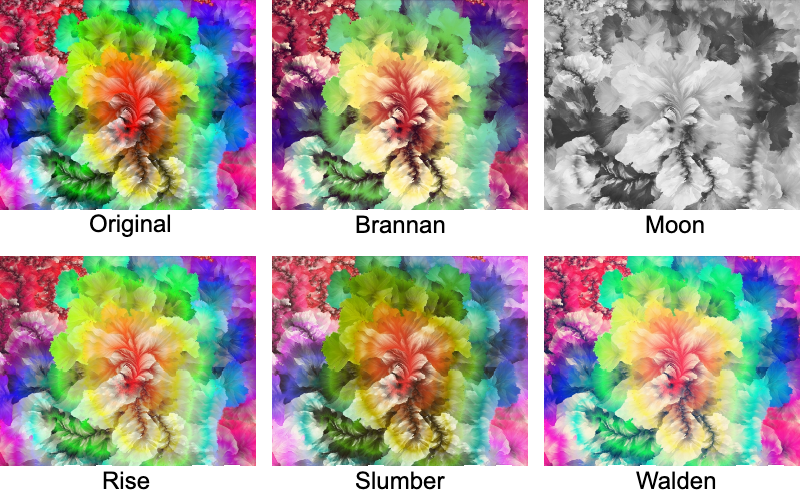

# Instafilter
This repo is implemented on original repo : [instafilter](https://github.com/thoppe/instafilter).

I implemented flask api server to run the model and get result via http protocol.
And also I made web frontend page to test demo.
# Example
Instafilter modifiy images using Instagram-like filters based on pytorch

## How to run
**Run right now!**  
[](https://ainize.ai/gmlee329/instafilter?branch=master)

[DEMO](https://master-instafilter-gmlee329.endpoint.ainize.ai)

**In local**  
It must need GPU so, [Nvidia-docker](https://github.com/NVIDIA/nvidia-docker) is needed.
```bash 
$ git clone https://github.com/gmlee329/instafilter.git
$ cd instafilter
$ docker build -t insta .
$ docker run --gpus 0 -it -p <host port>:80 --name insta insta
```
Then flask server will run in docker container

If you want to check the web demo page,  
install ngrok and enter the command below
```bash
$ ~/ngrok http <hostport>
```
Then, you can run the model and get result via webpage. 

#
# README from origin repo


[](https://img.shields.io/pypi/pyversions/instafilter.svg)
[](https://pypi.python.org/pypi/instafilter)

Modifiy images using Instagram-like filters in python. [Read how it works on Medium](https://medium.com/@travis.hoppe/instagram-filters-in-python-acc1ee7e67bc)!

    pip install instafilter

Example:

``` python
from instafilter import Instafilter

model = Instafilter("Lo-fi")
new_image = model("myimage.jpg")

# To save the image, use cv2
import cv2
cv2.imwrite("modified_image.jpg", new_image)
```

## Sample images

Browse samples for every filter in [`development/examples`](development/examples).

**Ludwig**
[](examples/Ludwig.jpg)

**Stinson**
[](examples/Stinson.jpg)

**Moon**
[](examples/Moon.jpg)

## Train

See the code in [`development/train_new_model`](development/train_new_model) to train a new model.

## Roadmap

+ Medium post

## Credits

+ Made with ❤️ by [Travis Hoppe](https://twitter.com/metasemantic?lang=en).

+ Header image sourced from [Will Terra](https://unsplash.com/photos/qIY9mUKT540) and modified with instafilter.
